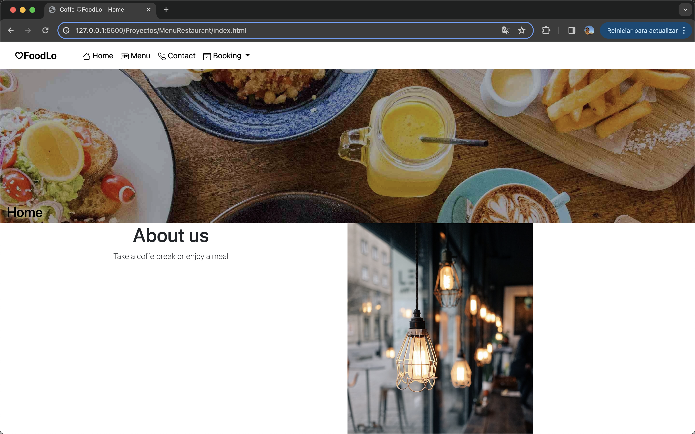
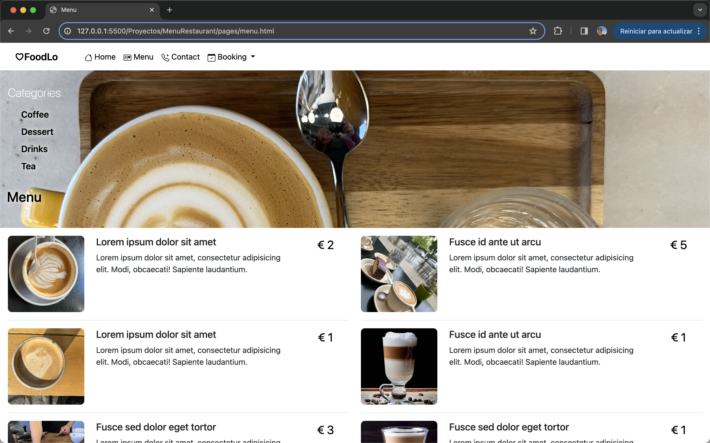
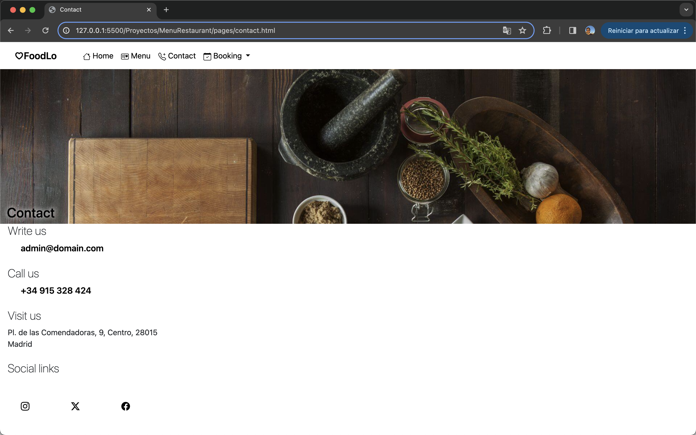
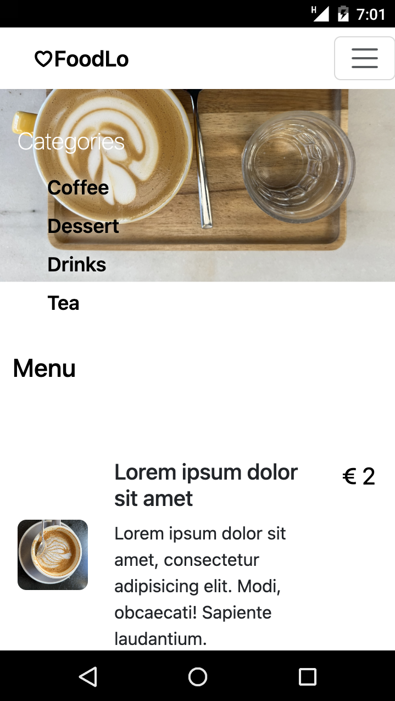
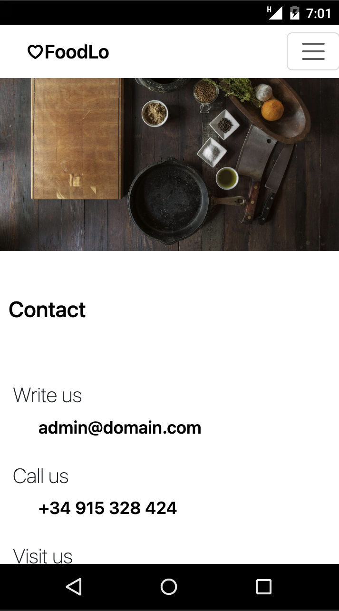

# Coffee shop website and HTML menu

2️⃣ It's the first Project of the Full Stack Development Bootcamp with Geekshubs Academy. Based only on HTML, CSS and BOOTSTRAP.

<details>
  <summary>Content 📝</summary>
  <ol>
    <li><a href="#objetive-🎯 ">Objetive</a></li>
    <li><a href="#about-a-project-🔎-🔎">About to the project</a></li>
    <li><a href="#deploy-🚀">Deploy</a></li>
    <li><a href="#stack">Stack</a></li>
    <li><a href="#local-installation">Installation</a></li>
    <li><a href="#view">View</a></li>
    <li><a href="#future-features">Future features</a></li>
    <li><a href="#contributions">Contributions</a></li>
    <li><a href="#license">Licence</a></li>
    <li><a href="#webgraphy">Webgraphy</a></li>
    <li><a href="#development">Development</a></li>
    <li><a href="#acknowledgments">Acknowledgments</a></li>
    <li><a href="#contact">Contact</a></li>
  </ol>
</details>

## Objetive 🎯

This project it's development in HTML, don't need any configuration.

## About a project 🔎

It is a simple web page menu about a coffe shop, the desing its responsive to use on cell phon, computer or tablet.

## Deploy 🚀

<div align="center">
    <a href="https://ramer8.github.io/menuRestaurant/pages/contact.html"><strong>Url a producción </strong></a>🚀🚀🚀
</div>

## Stack

<div align="center">

<div align="center">
<a href="https://developer.mozilla.org/es/docs/Web/HTML">
    
</a>
<a href="https://developer.mozilla.org/es/docs/Web/CSS">
    
</a>
<a href="https://www.github.com/">
    
</a>
<a href="https://www.github.com/">
    
</a>
<a href="https://www.github.com/">
    
</a>
 </div>

## Local installation

1. Clone the repository
2. Install live server extension in Visual Studio Code
3. From index.html go live to see the web page.

## View

Landing/Home
  
Menu

Contact

Landing/Home Mobile

Menu Mobile

Contact Mobile


## Future features

✅ Add Booking page section
⬜ Add e-commerce page section
⬜ Add more products to complete menu webpage

## Contributions

Suggestions and contributions are always welcome.

You can do it in two ways:

1.Opening an issue
2.Create a fork of the repository

- Createa a new branch
  ```
  $ git checkout -b feature/userName-improvement
  ```
- Make a commit with your changes
  ```
  $ git commit -m 'feat: better thing by'
  ```
- Push the branch
  ```
  $ git push origin feature/userName-improvement
  ```
- Open a Pull Request

## License

This project is under license by Ramiro Poblete

## Webgraphy:

To achieve my goal I have collected information from:

- https://getbootstrap.com/
- https://developer.mozilla.org/es/

## Development:

```js
const developer = "Ramiro Poblete"

console.log("Developed by: Ramiro Poblete + GeekHub")
```

## Acknowledgments:

I thank my colleagues for their time dedicated to this project:

**Carlos**
<a href="https://github.com/Dave86dev" target="_blank"></a>

## Contact

<a href = "mailto:ramirolpoblete@gmail.com"></a>
<a href="https://www.linkedin.com/in/ramiropoblete/" target="_blank"></a>

</p>
